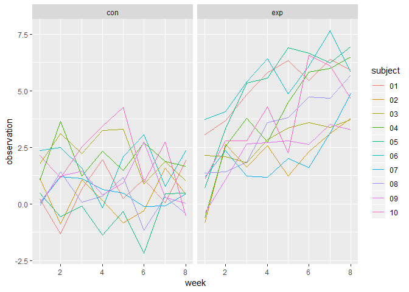
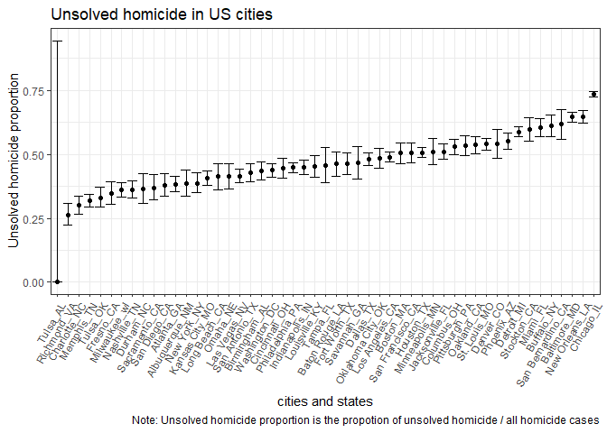

p8105\_hw5\_yl3181
================
Yuelin
November 2, 2018

Problem 1
---------

``` r
#Load needed libraries
library(tidyverse)
library(purrr)
```

``` r
#Extract file name and read contents from each file
file_name = list.files("./data", full.names = TRUE)
read_file = function(name){
  read_csv(name)
}
file_content = map_df(file_name, read_file)

#Combine name with corresponding contents into one file and tidy it
file = cbind(file_name,file_content) %>%
  separate(file_name, into = c("waste1", "arm", "waste2", "subject","waste3"), sep = c(7,10,11,13)) %>% 
  select(-starts_with("waste")) %>% 
  gather(key = "week", value = "observation", starts_with("week")) %>% 
  mutate(week = as.numeric(str_replace(week, "week_", "")))
```

``` r
#Make a spaghetti plot with two panels for better observe the difference
ggplot(file, aes(x = week, y = observation, color = subject)) + geom_line() + facet_grid(~arm)
```



As we can see in the plot:

-   The baseline for control group and experiment group are similar;
-   The experiment group has a more rapid increase in observation values, while control group has little change in observation values

Problem 2
---------

``` r
#Load and describe raw data
raw_homi = read_csv("homicide-data.csv")
knitr::kable(summary(raw_homi))
```

|     |        uid       | reported\_date    | victim\_last     | victim\_first    | victim\_race     |    victim\_age   |    victim\_sex   |       city       |       state      |      lat      |       lon       | disposition      |
|-----|:----------------:|:------------------|:-----------------|:-----------------|:-----------------|:----------------:|:----------------:|:----------------:|:----------------:|:-------------:|:---------------:|:-----------------|
|     |   Length:52179   | Min. : 20070101   | Length:52179     | Length:52179     | Length:52179     |   Length:52179   |   Length:52179   |   Length:52179   |   Length:52179   |  Min. :25.73  |  Min. :-122.51  | Length:52179     |
|     | Class :character | 1st Qu.: 20100318 | Class :character | Class :character | Class :character | Class :character | Class :character | Class :character | Class :character | 1st Qu.:33.77 | 1st Qu.: -96.00 | Class :character |
|     |  Mode :character | Median : 20121216 | Mode :character  | Mode :character  | Mode :character  |  Mode :character |  Mode :character |  Mode :character |  Mode :character | Median :38.52 | Median : -87.71 | Mode :character  |
|     |        NA        | Mean : 20130899   | NA               | NA               | NA               |        NA        |        NA        |        NA        |        NA        |  Mean :37.03  |  Mean : -91.47  | NA               |
|     |        NA        | 3rd Qu.: 20150911 | NA               | NA               | NA               |        NA        |        NA        |        NA        |        NA        | 3rd Qu.:40.03 | 3rd Qu.: -81.76 | NA               |
|     |        NA        | Max. :201511105   | NA               | NA               | NA               |        NA        |        NA        |        NA        |        NA        |  Max. :45.05  |  Max. : -71.01  | NA               |
|     |        NA        | NA                | NA               | NA               | NA               |        NA        |        NA        |        NA        |        NA        |    NA's :60   |     NA's :60    | NA               |

Raw data description:

-   The raw data contains 52179 observations and 12 variables;
-   Among these variables, there are 9 character variables and 3 numerical variables;
-   Key variables includes reported\_date, victim\_race, victim\_age, victim\_sex;
-   Example observations are:

| uid        |  reported\_date| victim\_last | victim\_first | victim\_race | victim\_age | victim\_sex | city        | state |       lat|        lon| disposition           |
|:-----------|---------------:|:-------------|:--------------|:-------------|:------------|:------------|:------------|:------|---------:|----------:|:----------------------|
| Alb-000001 |        20100504| GARCIA       | JUAN          | Hispanic     | 78          | Male        | Albuquerque | NM    |  35.09579|  -106.5386| Closed without arrest |
| Alb-000002 |        20100216| MONTOYA      | CAMERON       | Hispanic     | 17          | Male        | Albuquerque | NM    |  35.05681|  -106.7153| Closed by arrest      |
| Alb-000003 |        20100601| SATTERFIELD  | VIVIANA       | White        | 15          | Female      | Albuquerque | NM    |  35.08609|  -106.6956| Closed without arrest |

``` r
# Create a city_state variable and get the number of total and unsolved homicides
homi = raw_homi %>% 
  mutate(city_state = str_c(city, state, sep = "_")) %>% 
  group_by(city_state) %>% 
  summarise(total_homi = n(), unsol_homi = sum(disposition %in% c("Closed without arrest", "Open/No arrest")))

# One sample propotion test for Baltimore, MD
prop.test(homi[homi$city_state == "Baltimore_MD",]$unsol_homi, homi[homi$city_state == "Baltimore_MD",]$total_homi) %>% 
  broom::tidy() %>% 
  select(estimate, starts_with("conf.")) %>% 
  knitr::kable()
```

|   estimate|   conf.low|  conf.high|
|----------:|----------:|----------:|
|  0.6455607|  0.6275625|  0.6631599|

This table shows the point estimate and the confidence interval of homicide proportion for Baltimore, MD.

``` r
# One sample propotion test for all cities in a dataframe
test_homi = homi %>% 
  mutate(prop = purrr::map2(.x = unsol_homi, .y = total_homi, .f = ~broom::tidy(prop.test(.x, .y)))) %>%
  unnest() %>% 
  select(city_state, estimate, starts_with("conf."))

# Generate plot for estimates and CIs
test_homi %>% 
  ggplot(aes(x = fct_reorder(city_state, estimate), y = estimate)) + 
  geom_point() + 
  geom_errorbar(aes(ymin = conf.low, ymax = conf.high)) +
  labs(
    title = "Unsolved homicide in US cities",
    x = "cities and states",
    y = "Unsolved homicide proportion",
    caption = "Note: Unsolved homicide proportion is the propotion of unsolved homicide / all homicide cases"
  ) + 
  theme_bw() +
  theme(axis.text.x = element_text(angle = 60, hjust = 1))
```


